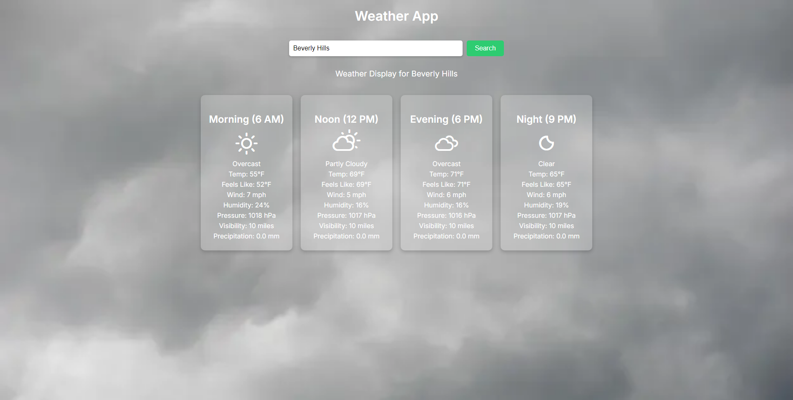

# Weather App

A simple and modern weather app that displays weather forecasts, including current weather conditions, temperature, humidity, wind speed, and more. The app uses **[wttr.in](https://wttr.in/)** to fetch weather data and shows it in a user-friendly interface. It also dynamically changes the background based on the weather condition for a more immersive experience.

## Features

- **Weather Display**: Shows the current weather forecast for any city, including temperature, wind speed, humidity, pressure, visibility, and precipitation.
- **Hourly Forecast**: Displays weather information for morning, noon, evening, and night, with icons representing different weather conditions.
- **Dynamic Background**: Changes the background image based on the current weather condition (e.g., sunny, cloudy, rainy, snowy).
- **Search for City**: Allows users to search for weather data by entering a city name. Press **Enter** after typing the city name to trigger the search.
- **Weather Icons**: Uses weather icons to visually represent the weather conditions (sunny, cloudy, rain, etc.).
- **User-Friendly Interface**: Displays weather data in a structured, easy-to-read layout with sections for different times of day.

## Installation

To run this project locally:

1. **Clone the repository**:
   ```bash
   git clone https://github.com/or1z/Weather-App.git
   ```

2. **Navigate into the project directory**:
   ```bash
   cd Weather-App
   ```

3. **Open the `index.html` file in your web browser**:
   Double-click the `index.html` file or open it through your preferred browser.

## How to Use

1. **Search for Weather**: Type the name of a city into the search bar and press **Enter** or click the **Search** button.
2. **View the Forecast**: The weather details for the city will be displayed, showing the current weather conditions, as well as hourly forecasts for morning, noon, evening, and night.
3. **Background Changes**: The background of the website will automatically change to reflect the current weather condition of the city you're viewing.

## Screenshot


## Technologies Used

- **HTML**: For structuring the content.
- **CSS**: For styling the app and ensuring responsiveness.
- **JavaScript**: For fetching weather data, dynamically updating the UI, and handling user interactions.
- **API**: Uses the **[wttr.in](https://wttr.in/)** API to fetch weather data in JSON format.

## Future Features

- **Geolocation**: Automatically fetch weather data based on the user’s current location.

## License

This project is licensed under the MIT License - see the [LICENSE](LICENSE) file for details.

## Acknowledgements

- **[wttr.in](https://wttr.in/)**: For providing the weather data via a simple API.
- **Weather Icons**: Used for weather condition representations.
- **Free Images**: Background images for different weather conditions (e.g., sunny, cloudy, rainy).
